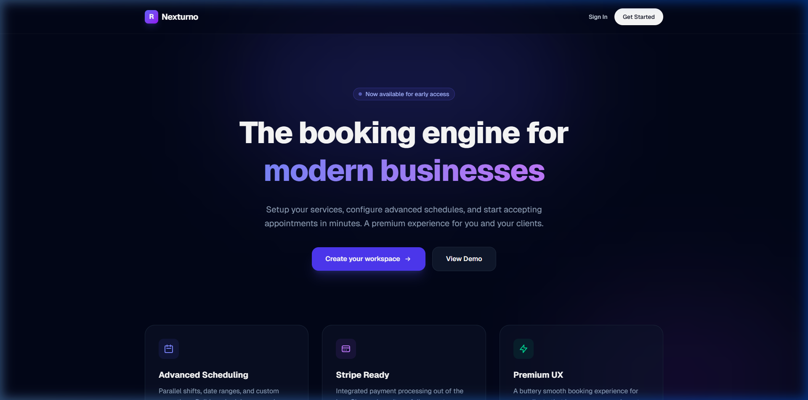
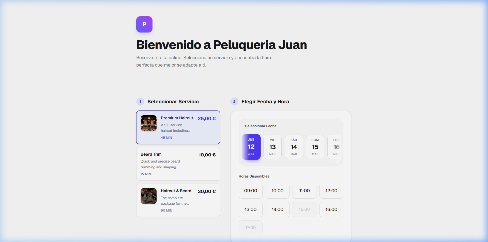
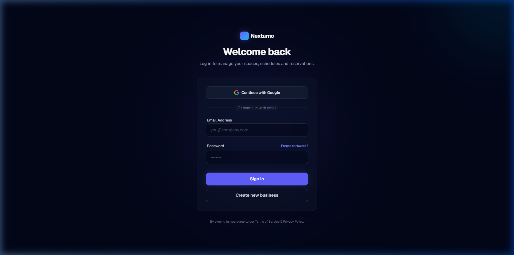

# Nexturno — Plataforma SaaS de Reservas B2B2C

[](https://reserver-seven.vercel.app/)
[](https://nextjs.org/)
[](https://react.dev/)
[](https://supabase.com/)
[](https://stripe.com/)

> **Trabajo de Fin de Máster (TFM)** — Sistema de reservas multi-tenant con Clean Architecture, TDD y máxima calidad de software.

🔗 **Producción:** [https://reserver-seven.vercel.app](https://reserver-seven.vercel.app/)

---

## 📸 Capturas de Pantalla

<p align="center">
  
</p>
<p align="center"><em>Landing page — Página principal de Nexturno</em></p>

<p align="center">
  
</p>
<p align="center"><em>Interfaz de reservas — Selección de servicio, fecha y hora disponible</em></p>

<p align="center">
  
</p>
<p align="center"><em>Panel de administración — Login con Google OAuth y email/contraseña</em></p>

---

## 📋 Descripción

**Nexturno** es una plataforma SaaS de reservas orientada al modelo B2B2C. Permite a negocios (peluquerías, clínicas, consultas, etc.) configurar sus servicios, horarios y excepciones, y ofrecer a sus clientes finales una experiencia de reserva moderna y fluida.

### Funcionalidades principales

| Área | Funcionalidad |
|---|---|
| **Multi-tenancy** | Cada negocio dispone de su propio espacio (`/[tenantSlug]`) con página de reservas pública personalizada |
| **Panel de Administración** | Dashboard completo para gestionar reservas, servicios, horarios e integraciones |
| **Reservas online** | Selección de servicio → fecha → franja horaria → confirmación, con verificación de disponibilidad en tiempo real |
| **Pagos con Stripe** | Integración con Stripe Connect para cobros y depósitos directos en la cuenta del negocio |
| **Notificaciones** | Emails transaccionales vía Resend y notificaciones vía Telegram |
| **Recordatorios automáticos** | Cron job diario (Vercel Cron) que envía recordatorios de citas próximas |
| **Google Calendar** | Sincronización de reservas con Google Calendar del negocio |
| **Portal del cliente** | Área donde los clientes finales pueden gestionar sus reservas |
| **Onboarding** | Flujo guiado de alta para nuevos negocios |
| **Internacionalización** | Soporte completo para Español e Inglés con `next-intl` |
| **Autenticación** | Login con email/contraseña y OAuth con Google vía Supabase Auth |
| **Gestión de horarios** | Turnos paralelos, rangos de fechas y excepciones personalizadas |

---

## 🏛️ Arquitectura

El proyecto sigue los principios de **Clean Architecture (Hexagonal)** con una separación clara en capas:

```
src/
├── core/                          # Núcleo de negocio (sin dependencias externas)
│   ├── domain/
│   │   └── entities/              # Entidades: Booking, Service, Schedule, Tenant, ScheduleException
│   └── application/
│       ├── use-cases/             # Casos de uso: CheckAvailability, CreateBooking, SendBookingReminders
│       └── ports/                 # Interfaces/contratos (IBookingRepository)
│
├── infrastructure/                # Adaptadores de infraestructura
│   ├── database/supabase/         # Repositorio Supabase (implementa IBookingRepository)
│   ├── payments/stripe/           # Servicio de pagos Stripe Connect
│   ├── notifications/
│   │   ├── resend/                # Emails transaccionales
│   │   └── telegram/              # Notificaciones Telegram
│   └── calendar/                  # Sincronización Google Calendar
│
├── app/                           # Capa de presentación (Next.js App Router)
│   ├── [locale]/                  # Rutas i18n (es, en)
│   │   ├── [tenantSlug]/          # Página pública de reservas del negocio
│   │   ├── admin/                 # Panel de administración
│   │   │   ├── login/
│   │   │   ├── onboarding/
│   │   │   └── (dashboard)/       # Bookings, Services, Schedules, Integrations
│   │   └── portal/                # Portal del cliente final
│   ├── api/                       # Route Handlers
│   │   ├── cron/reminders/        # Cron job de recordatorios
│   │   ├── stripe/                # Webhooks y conexión Stripe
│   │   ├── webhooks/              # Webhooks entrantes
│   │   └── integrations/          # OAuth Google Calendar
│   └── actions/                   # Server Actions (adaptadores primarios)
│
├── components/                    # Componentes compartidos (auth, UI)
├── i18n/                          # Configuración de internacionalización
└── utils/                         # Utilidades (cliente Supabase, helpers)
```

### Flujo de datos

```
Cliente (Browser)
    ↓ Server Actions / API Routes
Presentation Layer (Next.js App Router)
    ↓
Application Layer (Use Cases)
    ↓ Ports (interfaces)
Infrastructure Layer (Supabase, Stripe, Resend, Google Calendar)
```

---

## 🛠️ Stack Tecnológico

### Frontend
| Tecnología | Versión | Propósito |
|---|---|---|
| **Next.js** | 16.1 | Framework React con App Router y Server Components |
| **React** | 19.2 | Librería de UI |
| **TailwindCSS** | 4 | Utility-first CSS |
| **next-intl** | 4.8 | Internacionalización (i18n) |

### Backend & Infraestructura
| Tecnología | Propósito |
|---|---|
| **Supabase** | Base de datos PostgreSQL, autenticación (email + OAuth Google), Row Level Security |
| **Stripe** | Pagos vía Stripe Connect y Checkout Sessions |
| **Resend** | Emails transaccionales (confirmaciones, recordatorios) |
| **Telegram Bot API** | Notificaciones push al negocio |
| **Google Calendar API** | Sincronización de citas |
| **Vercel** | Hosting, Edge Functions y Cron Jobs |

### Testing
| Herramienta | Propósito |
|---|---|
| **Vitest** | Tests unitarios (core del dominio, casos de uso `>90% coverage`, repositorios y adaptadores). |
| **Playwright** | Tests End-to-End (flujos de reserva pública, login corporativo y onboarding de tenants). |
| **Testing Library** | Tests de componentes React. |

### Lenguaje
- **TypeScript 5** — Tipado estricto en todo el proyecto

---

## 🗄️ Base de Datos

Esquema gestionado con migraciones SQL incrementales en `supabase/migrations/`:

- `tenants` — Negocios registrados (multi-tenant)
- `services` — Servicios ofrecidos por cada negocio
- `schedules` — Horarios con turnos paralelos y rangos de fechas
- `schedule_exceptions` — Excepciones y días festivos
- `bookings` — Reservas con estado y token de gestión
- `customers` — Clientes finales (B2C)
- `tenant_integrations` — Conexiones con servicios externos (Google Calendar)
- **Row Level Security (RLS)** en todas las tablas

---

## 🚀 Puesta en marcha

### Prerrequisitos

- Node.js ≥ 18
- Cuenta en [Supabase](https://supabase.com/)
- Cuenta en [Stripe](https://stripe.com/) (con Connect habilitado)
- (Opcional) API Key de [Resend](https://resend.com/)
- (Opcional) Token de bot de Telegram
- (Opcional) Credenciales OAuth de Google Calendar

### Instalación

```bash
# Clonar el repositorio
git clone <url-del-repositorio>
cd booking-saas-tfm

# Instalar dependencias
npm install

# Configurar variables de entorno
cp .env.local.example .env.local
# Editar .env.local con las credenciales de Supabase, Stripe, etc.

# Ejecutar en modo desarrollo
npm run dev
```

La aplicación estará disponible en [http://localhost:3003](http://localhost:3003).

### Variables de entorno requeridas

| Variable | Descripción |
|---|---|
| `NEXT_PUBLIC_SUPABASE_URL` | URL del proyecto Supabase |
| `NEXT_PUBLIC_SUPABASE_ANON_KEY` | Clave anónima de Supabase |
| `STRIPE_SECRET_KEY` | Clave secreta de Stripe |
| `STRIPE_WEBHOOK_SECRET` | Secreto para verificar webhooks de Stripe |
| `RESEND_API_KEY` | API Key de Resend para emails |
| `NEXT_PUBLIC_SITE_URL` | URL pública de la aplicación |

---

## 🧪 Testing

```bash
# Tests unitarios con coverage report (Application & Infrastructure)
npx vitest run --coverage --exclude e2e

# Tests E2E (Flujos de Booking, Login y Onboarding)
npx playwright test

# Tests Unitarios con interfaz gráfica (UI)
npx vitest --ui
```

---

## 📄 Licencia

Este proyecto está bajo la licencia **MIT**. Consulta el archivo [LICENSE](LICENSE) para más detalles.
